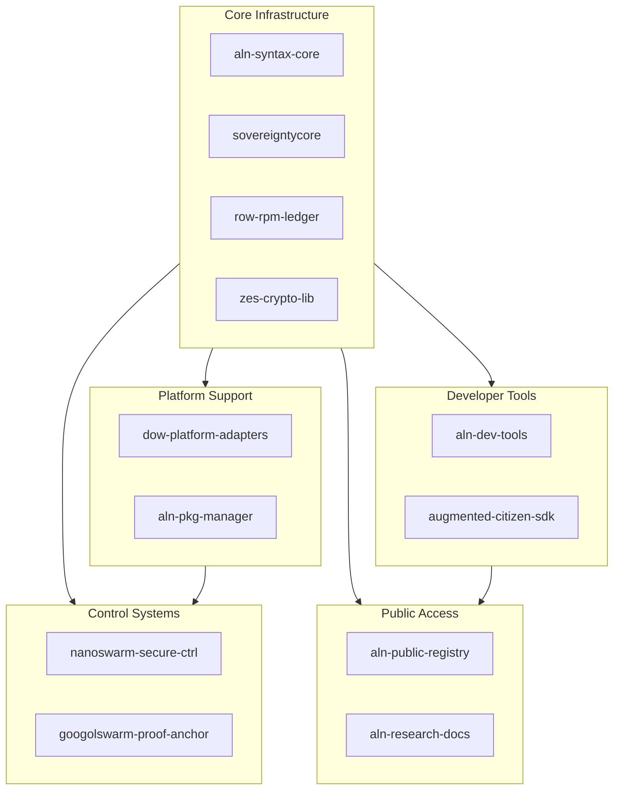

# ALN Sovereign Stack Architecture Overview

## Executive Summary

The ALN Sovereign Stack is a comprehensive security framework designed to protect Nanoswarm, Googolswarm, and all Augmented-Citizen capabilities from infiltration, weaponization, and unauthorized control. This document provides a complete architectural overview of all components and their interdependencies.

## System Architecture



## Component Overview

| Component | Purpose | Key Security Properties |
|-----------|---------|------------------------|
| `aln-syntax-core` | Schema definitions and validation | Type safety, schema versioning |
| `sovereigntycore` | Enforcement engine | Capability gating, NDM integration |
| `row-rpm-ledger` | Append-only ledger | Immutability, offline anchoring |
| `zes-crypto-lib` | Quantum-safe encryption | Multi-DID envelopes, PQ cryptography |
| `nanoswarm-secure-ctrl` | Nanoswarm control | Non-weaponization, NDM freeze |
| `googolswarm-proof-anchor` | Proof anchoring | Multi-ledger redundancy |
| `aln-dev-tools` | Developer tooling | Early violation detection |
| `augmented-citizen-sdk` | Application SDK | Built-in sovereignty |
| `aln-public-registry` | Public artifact registry | Mirror resilience, takedown |
| `aln-research-docs` | Documentation | Public auditability |

## Security Architecture

### Defense in Depth

1. **Layer 1: Syntax Validation** - `aln-syntax-core` ensures all artifacts conform to canonical schemas
2. **Layer 2: Capability Enforcement** - `sovereigntycore` gates all privileged operations
3. **Layer 3: NDM Monitoring** - Real-time scoring with automatic freeze on suspicion
4. **Layer 4: Ledger Anchoring** - All actions logged to immutable ROW/RPM ledger
5. **Layer 5: Cryptographic Verification** - Zes-encryption with multi-DID signatures

### Non-Weaponization Guarantees

| Guarantee | Implementation | Enforcement Point |
|-----------|----------------|-------------------|
| No remote weaponization | Forbidden capability combos | `sovereigntycore/aln-sourze-guard` |
| No hardware takeover | Capability lattice | `sovereigntycore/capability_lattice` |
| No unauthorized control | NDM freeze protocol | `nanoswarm-secure-ctrl` |
| No credential theft | Bostrom DID auth | `augmented-citizen-sdk` |
| No offline bypass | Snapshot verification | `row-rpm-ledger` |

## Data Flow

```
Developer → ALN Dev Tools → Zes-Encrypt → Sovereignty Core → ROW/RPM Ledger → Googolswarm → Public Registry
```

## Governance Model

All components follow ROW/RPM governance with:
- Multi-sig approval for security-critical changes
- Hex-stamp attestation for all artifacts
- Public audit trail via ledger anchoring
- Community contribution with DID anchoring

---

**Document Hex-Stamp:** `0x1f2f9e3d0c8b4a6f5e0d9c8b7a6f5e4d3c2b1a09f8e7d6c5b4a3928170f6e5d4`  
**Last Updated:** 2026-03-04
```
