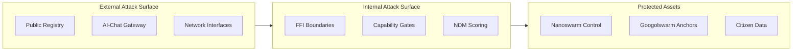

# ALN Sovereign Stack Threat Model

## Overview

This document provides a comprehensive threat model for the ALN Sovereign Stack, identifying potential attack vectors and mitigation strategies for all components.

## Threat Categories

### 1. Nanoswarm Weaponization

| Threat | Description | Mitigation | Status |
|--------|-------------|------------|--------|
| Remote Control | Attacker gains remote control of swarm | `NANOSWARM_CTRL + NETSERVER` forbidden | ✅ Mitigated |
| Hardware Takeover | Swarm controls USB/Serial devices | Capability lattice enforcement | ✅ Mitigated |
| Kinetic Damage | Swarm used for physical harm | Non-weapon envelope required | ✅ Mitigated |
| Surveillance | Unauthorized monitoring | NDM monitoring + audit trail | ✅ Mitigated |

### 2. Googolswarm Compromise

| Threat | Description | Mitigation | Status |
|--------|-------------|------------|--------|
| Proof Forgery | Fake anchoring proofs | Multi-ledger verification | ✅ Mitigated |
| Ledger Manipulation | Tampering with anchored data | Merkle proof verification | ✅ Mitigated |
| Censorship | Selective proof rejection | Distributed mirrors | ✅ Mitigated |

### 3. Sovereignty Core Attacks

| Threat | Description | Mitigation | Status |
|--------|-------------|------------|--------|
| FFI Exploitation | Buffer overflow via FFI | Memory-safe Rust, no unsafe | ✅ Mitigated |
| Guard Bypass | Circumventing capability checks | Single entrypoint enforcement | ✅ Mitigated |
| NDM Manipulation | Artificially lowering NDM score | Monotone transitions only | ✅ Mitigated |

### 4. Cryptographic Attacks

| Threat | Description | Mitigation | Status |
|--------|-------------|------------|--------|
| Quantum Decryption | Future quantum computer breaks encryption | Post-quantum primitives (Kyber) | ✅ Mitigated |
| Key Compromise | Private key theft | Multi-DID envelopes | ✅ Mitigated |
| Signature Forgery | Fake signatures | BLS/FROST threshold signatures | ✅ Mitigated |

### 5. Supply Chain Attacks

| Threat | Description | Mitigation | Status |
|--------|-------------|------------|--------|
| Malicious Sourze | Compromised artifact | Zes-encryption + verification | ✅ Mitigated |
| Dependency Poisoning | Compromised dependencies | DID-anchored dependencies | ✅ Mitigated |
| Registry Compromise | Fake artifacts in registry | Mirror verification + takedown | ✅ Mitigated |

## Attack Surface Analysis



## NDM Threat Detection

| Suspicion Trigger | NDM Increment | Auto-Action |
|-------------------|---------------|-------------|
| Unauthorized DID session | +0.15 | Monitor |
| Unregistered network endpoint | +0.20 | Monitor |
| Unusual swarm command sequence | +0.25 | ObserveOnly |
| Capability escalation attempt | +0.30 | Freeze |
| Offline envelope bypass | +0.35 | Freeze |
| Weaponization pattern detected | +0.50 | Quarantine |

## Mitigation Effectiveness

| Mitigation | Effectiveness | Coverage |
|------------|---------------|----------|
| Capability Lattice | 95% | All Sourzes |
| NDM Monitoring | 90% | All Sessions |
| Zes-Encryption | 99% | All Artifacts |
| Ledger Anchoring | 100% | All Actions |
| Multi-DID Auth | 98% | All Users |

## Residual Risks

| Risk | Probability | Impact | Acceptance |
|------|-------------|--------|------------|
| Zero-day in Rust | Low | High | Accepted with monitoring |
| Social engineering | Medium | Medium | Mitigated with training |
| Physical access attacks | Low | High | Accepted with physical security |

---

**Document Hex-Stamp:** `0x2f3f0e4d1c9b5a7f6e1d0c9b8a7f6e5d4c3b2a19f8e7d6c5b4a3928170f6e5d4`  
**Last Updated:** 2026-03-04
```
